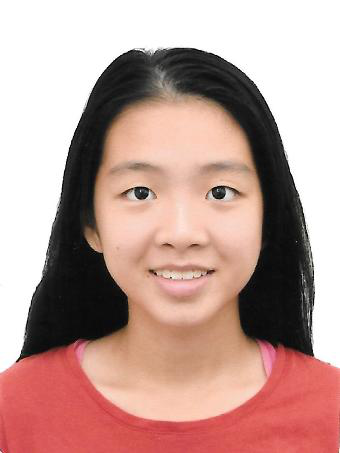
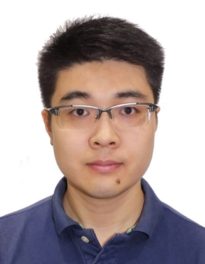

We are a team based in the [School of Computing, National University of Singapore](http://www.comp.nus.edu.sg).

You can reach us at the email `seer[at]comp.nus.edu.sg`

## Project team

### Tan Ying Hui

[[github](https://github.com/ureshiiYing)]
[[portfolio](team/tanyinghui.md)]

* Role: Developer
* Responsibilities: Documentation

### Yan BingTao

[[github](https://github.com/yanbingtao)]
[[portfolio](team/yanbingtao.md)]

* Role: Developer
* Responsibilities: Integration - In charge of versioning of the code, maintaining the code repository, integrating various parts of the software to create a whole.

### Wang Mo

[[github](http://github.com/WM71811)] 
[[portfolio](team/wangmo.md)]

* Role: Developer
* Responsibilities: Code Quality

### Wang Qian

[[github](http://github.com/persdre)]
[[portfolio](team/wangqian.md)]

* Role: Developer & Code Quality Reviewer
* Responsibilities: Develop & Check code quality

### Zhang Yi

[[homepage](http://www.comp.nus.edu.sg)]
[[github](https://github.com/Diwu-Yi)]
[[portfolio](team/zhangyi.md)]

* Role: Project Tester and Contributor
