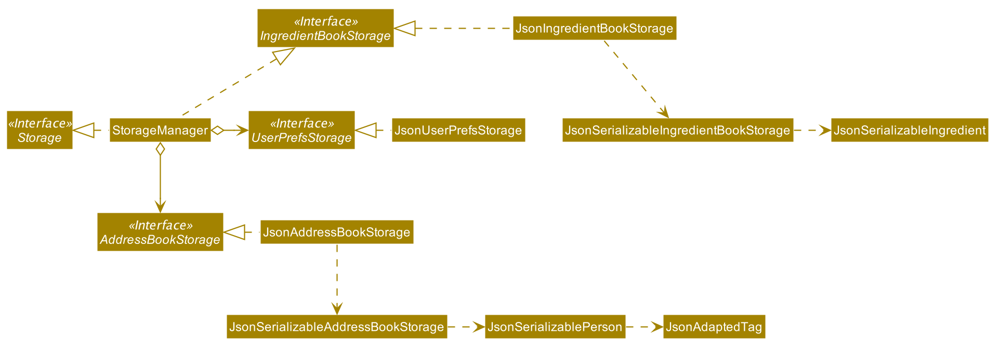
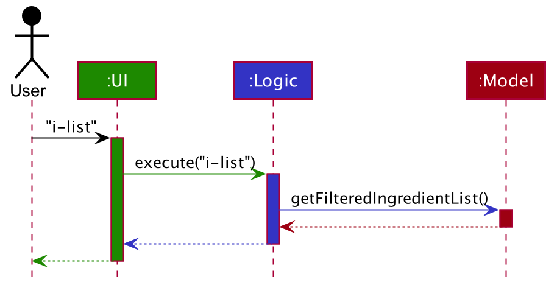
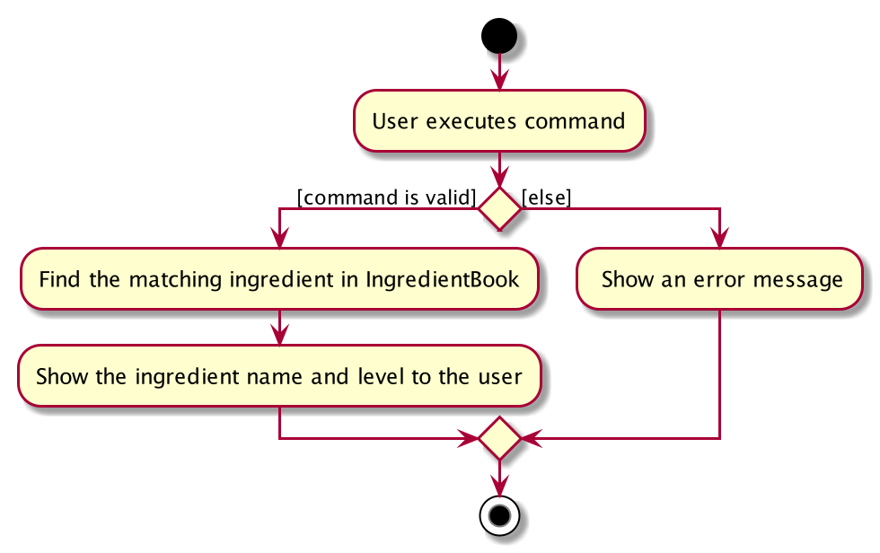
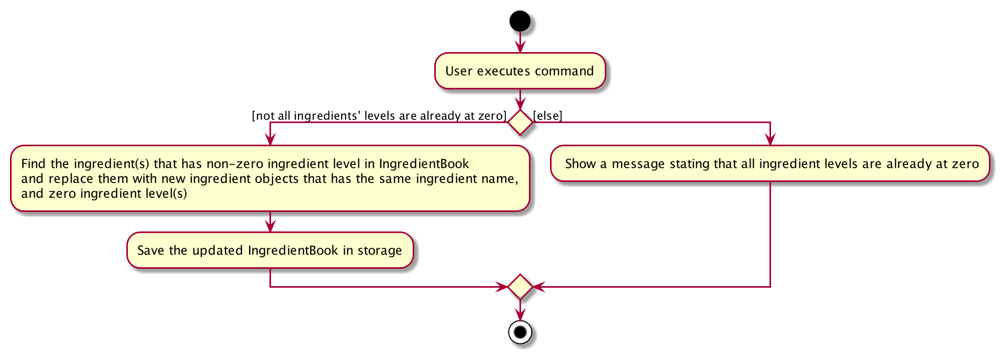

* Table of Contents
{:toc}

--------------------------------------------------------------------------------------------------------------------

## **Setting up, getting started**

Refer to the guide [_Setting up and getting started_](SettingUp.md).

--------------------------------------------------------------------------------------------------------------------

## **Design**

### Architecture

The ***Architecture Diagram*** given above explains the high-level design of the App. Given below is a quick overview of each component.

:bulb: **Tip:** The `.puml` files used to create diagrams in this document can be found in the [diagrams](https://github.com/se-edu/addressbook-level3/tree/master/docs/diagrams/) folder. Refer to the [_PlantUML Tutorial_ at se-edu/guides](https://se-education.org/guides/tutorials/plantUml.html) to learn how to create and edit diagrams.

**`Main`** has two classes called [`Main`](https://github.com/se-edu/addressbook-level3/tree/master/src/main/java/seedu/address/Main.java) and [`MainApp`](https://github.com/se-edu/addressbook-level3/tree/master/src/main/java/seedu/address/MainApp.java). It is responsible for,
* At app launch: Initializes the components in the correct sequence, and connects them up with each other.
* At shut down: Shuts down the components and invokes cleanup methods where necessary.

[**`Commons`**](#common-classes) represents a collection of classes used by multiple other components.

The rest of the App consists of four components.

* [**`UI`**](#ui-component): The UI of the App.
* [**`Logic`**](#logic-component): The command executor.
* [**`Model`**](#model-component): Holds the data of the App in memory.
* [**`Storage`**](#storage-component): Reads data from, and writes data to, the hard disk.

Each of the four components,

* defines its *API* in an `interface` with the same name as the Component.
* exposes its functionality using a concrete `{Component Name}Manager` class (which implements the corresponding API `interface` mentioned in the previous point.

For example, the `Logic` component (see the class diagram given below) defines its API in the `Logic.java` interface and exposes its functionality using the `LogicManager.java` class which implements the `Logic` interface.

**How the architecture components interact with each other**

The *Sequence Diagram* below shows how the components interact with each other for the scenario where the user issues the command `delete 1`.

The sections below give more details of each component.

### UI component

**API** :
[`Ui.java`](https://github.com/se-edu/addressbook-level3/tree/master/src/main/java/seedu/address/ui/Ui.java)

The UI consists of a `MainWindow` that is made up of parts e.g.`CommandBox`, `ResultDisplay`, `PersonListPanel`, `StatusBarFooter` etc. All these, including the `MainWindow`, inherit from the abstract `UiPart` class.

The `UI` component uses JavaFx UI framework. The layout of these UI parts are defined in matching `.fxml` files that are in the `src/main/resources/view` folder. For example, the layout of the [`MainWindow`](https://github.com/se-edu/addressbook-level3/tree/master/src/main/java/seedu/address/ui/MainWindow.java) is specified in [`MainWindow.fxml`](https://github.com/se-edu/addressbook-level3/tree/master/src/main/resources/view/MainWindow.fxml)

The `UI` component,

* Executes user commands using the `Logic` component.
* Listens for changes to `Model` data so that the UI can be updated with the modified data.

### Logic component

**API** :
[`Logic.java`](https://github.com/se-edu/addressbook-level3/tree/master/src/main/java/seedu/address/logic/Logic.java)

1. `Logic` uses the `AddressBookParser` class to parse the user command.
1. This results in a `Command` object which is executed by the `LogicManager`.
1. The command execution can affect the `Model` (e.g. adding a person).
1. The result of the command execution is encapsulated as a `CommandResult` object which is passed back to the `Ui`.
1. In addition, the `CommandResult` object can also instruct the `Ui` to perform certain actions, such as displaying help to the user.

Given below is the Sequence Diagram for interactions within the `Logic` component for the `execute("delete 1")` API call.

:information_source: **Note:** The lifeline for `DeleteCommandParser` should end at the destroy marker (X) but due to a limitation of PlantUML, the lifeline reaches the end of diagram.

### Model component

**API** : [`Model.java`](https://github.com/se-edu/addressbook-level3/tree/master/src/main/java/seedu/address/model/Model.java)

The `Model`,

* stores a `UserPref` object that represents the user’s preferences.
* stores the address book data.
* exposes an unmodifiable `ObservableList<Person>` that can be 'observed' e.g. the UI can be bound to this list so that the UI automatically updates when the data in the list change.
* does not depend on any of the other three components.

:information_source: **Note:** An alternative (arguably, a more OOP) model is given below. It has a `Tag` list in the `AddressBook`, which `Person` references. This allows `AddressBook` to only require one `Tag` object per unique `Tag`, instead of each `Person` needing their own `Tag` object. 

### Storage component

**API** : [`Storage.java`](https://github.com/se-edu/addressbook-level3/tree/master/src/main/java/seedu/address/storage/Storage.java)

The `Storage` component,
* can save `UserPref` objects in json format and read it back.
* can save the address book data in json format and read it back.
* can save the ingredient book data in json format and read it back.

### Common classes

Classes used by multiple components are in the `seedu.addressbook.commons` package.

--------------------------------------------------------------------------------------------------------------------

## **Implementation**

This section describes some noteworthy details on how certain features are implemented.

### \[Completed\] Edit employees's contact information feature

Compared with the original implementation, this feature adds emergency contact information of the employee. It can help
the user to contact some staff when emergency situation happens. The command is:

- `edit INDEX [n/NAME] [p/PHONE] [e/EMERGENCY_CONTACT] [t/TAG] …​​`

#### Completed Implementation

The completed edit employee's contact information is facilitated by `AddressBook`. It implements `ReadOnlyAddressBook`
interface and offers method to edit the application's `AddressBook`. Particularly, it changes Person's constructor and 
function declarations to add emergency there.

Given below is an example usage scenario and how the edit mechanism behaves at each step.

Step 1: The user launches the application for the first time. Because now there isn't any information in addressbook. 
The user can't edit now.

Step 2: The user executes `add n/Betsy Crowe e/81234567 p/1234567 t/morning shift t/part-time`. The `add` command calls
`Model#addPerson()` to add Besty's information in the `AddressBook`. The updated `AddressBook` is stored in 
`addressbook.json`.

Step 3: The user executes `edit 1 n/Besty Crowe e/54749110 p/1234567 t/morning shift t/part-time` to change Besty Crowe's
phone number. This`edit` command calls `Model#setPerson()` to replace the original Besty Crowe's information in the 
`Addressbook`, causing the updated `Addressbook` to be stored in `addressbook.json`, overwriting the former one.

#### Design Consideration

##### Aspect: How to display the emergency contact

* **Alternative 1 (current choice):** Displays the emergency contact of the similar format
with phone number, using a prefix to identify them.
  * Pros: Easy to implement.
  * Cons: May seem a little redundancy.
* **Alternative 2:** Use different icons to represent phone and emergency contact 
  * Pros: Will be easy to tell from.
  * Cons: Need more work.

### \[Completed\] List ingredients' levels feature

#### Completed Implementation

The completed list ingredients' levels mechanism is facilitated by `IngredientBook`. It implements 
`ReadOnlyIngredientBook` interface and offers methods to view the ingredients' levels from the application's 
`ingredientBook`. Particularly, it implements the following operation:

* `IngredientBook#getFilteredIngredientList()` — Returns the list of ingredients consisting of ingredient names and 
ingredient levels in the ingredient book.

This operation is exposed in the `Model` interface as `Model#getFilteredIngredientList()`.

Given below is an example usage scenario and how the list ingredients' levels mechanism behaves at each step.

Step 1. The user launches the application. If the storage file for the ingredient book is empty, `IngredientBook` will 
be initialized with the five pre-defined ingredients, namely `Milk`, `Pearl`, `Boba`, `Oolong Tea` and `Brown Suagr`, 
with an amount of 0 for all. If the storage file for the ingredient book is not empty, `IngredientBook` will read the  
data from the storage file.

Step 2. The user executes `i-list` to view the list of all ingredients and their levels. The `i-list` command calls 
`Model#getFilteredIngredientList()`, which returns the list of ingredients in `IngredientBook`.

The following sequence diagram shows how the list ingredients operation works:

#### Design consideration:

##### Aspect: How list ingredients' levels executes

* **Alternative 1 (current choice):** Access the ingredient list and loop through the list to return the list of 
ingredients showing their ingredient names and levels.
  * Pros: Easier to implement and code is more readable.
  * Cons: Every execution of the command will loop through the list once, which can be avoided if an alternative design
  is used.
* **Alternative 2:** Maintain a field in `ingredientbook` that stores the string representing the list of ingredients in
terms of their ingredient names and levels.

  * Pros: Clearer implementation. `IngredientListCommand` will not need to manipulate the list of ingredients during
  execution.
  * Cons: This may result in a slower response of the application since the field would be updated every time the 
  ingredient list is updated.
  
  ## \[Completed\] View a single ingredient's level feature
  
  #### Completed Implementation
  
  The completed view a single ingredient's level mechanism is facilitated by `IngredientBook`. It implements 
  `ReadOnlyIngredientBook` interface and offers methods to view the ingredients' levels from the application's 
  `ingredientBook`. Particularly, it implements the following operation:
  
  * `IngredientBook#findIngredientByName(IngredientName ingredientName)` — Returns the ingredient with the target 
  ingredient name. 
  
  This operation is exposed in the `Model` interface as `Model#findIngredientByName(IngredientName ingredientName)`.
  
  Given below is an example usage scenario and how the view a single ingredient's level mechanism behaves at each step.
  
  Step 1. The user launches the application. If the storage file for the ingredient book is empty, `IngredientBook` will 
  be initialized with the five pre-defined ingredients, namely `Milk`, `Pearl`, `Boba`, `Oolong Tea` and `Brown Suagr`, 
  with an amount of 0 for all. If the storage file for the ingredient book is not empty, `IngredientBook` will read the  
  data from the storage file.
  
  Step 2. The user executes `i-view-single i/Milk` to view milk's current level. The `i-view-single i/Milk` command is
  parsed by `IngredientViewSingleCommandParser` which parses the ingredient to get the ingredient name and 
  returns an  `IngredientViewSingleCommand`. Logic executes the `IngredientViewSingleCommand` and calls 
  `Model#findIngredientByName(IngredientName ingredientName)`, which returns the ingredient with the ingredient name
  entered by the user.
  
  The following activity diagram shows how the view a single ingredient level operation works:
  
  #### Design consideration:
  
  ##### Aspect: How find the ingredient's level executes
  
  * **Alternative 1 (current choice):** Obtain the ingredient name of the ingredient entered by the user, and use the
  ingredient name to find the ingredient by looping through the ingredient list.
    * Pros: Code is more readable.
    * Cons: Every execution of the command will require one to access the name of the ingredient and loop through 
    the list once, which may increase the time required for the operation. 
    
  * **Alternative 2:** Map the ingredient entered by the user to a index which corresponds to the index of the 
  ingredient in the list, then find the ingredient using the index.
    * Pros: Do not require looping through the list every time `IngredientViewSingleCommand` executes.
    * Cons: Code may be less readable.
    
## \[Completed\] Reset all ingredients' levels feature
  
  #### Completed Implementation
  
  The completed reset all ingredients' levels mechanism is facilitated by `IngredientBook`. It implements 
  `ReadOnlyIngredientBook` interface and offers methods to view the ingredients' levels from the application's 
  `ingredientBook`. Particularly, it implements the following operation:
  
  * `IngredientBook#getFilteredIngredientList()` — Returns the list of ingredients consisting of ingredient names and 
  ingredient levels in the ingredient book.
  
  This operation is exposed in the `Model` interface as `Model#getFilteredIngredientList()`.
  
  Given below is an example usage scenario and how the reset all ingredients' levels mechanism behaves at each step.
  
  Step 1. The user launches the application. If the storage file for the ingredient book is empty, `IngredientBook` will 
  be initialized with the five pre-defined ingredients, namely `Milk`, `Pearl`, `Boba`, `Oolong Tea` and `Brown Suagr`, 
  with an amount of 0 for all. If the storage file for the ingredient book is not empty, `IngredientBook` will read the  
  data from the storage file.
  
  Step 2. The user executes `i-reset-all` to reset all ingredients' levels. The `i-reset-all` command calls
  `Model#getFilteredIngredientList()`, which returns the list of ingredients in `IngredientBook`. The list of 
  ingredients is checked to see whether all ingredient levels are already at zero. If it is true, the user will 
  be informed that all ingredient levels are already at zero. Otherwise, ingredients that have levels not at zero
  would be replaced by a new ingredient object with the same ingredient name and a zero ingredient level.
  
  The following activity diagram shows how the reset all ingredients' levels operation works:
  
  #### Design consideration:
  
  ##### Aspect: How reset the ingredients' levels executes
  
  * **Alternative 1 (current choice):** Loop through the ingredient list twice, the first time to check if all 
  ingredient levels are at zero, the second time to replace the original ingredient that has a non-zero ingredient 
  level with a new ingredient with the same ingredient name and a zero ingredient level.
    * Pros: Easier implementation.
    * Cons: Execution of the command may require one to create one or more new ingredients, which may increase the time 
    required for the operation. 
    
  * **Alternative 2:** Loop through the ingredient list twice, the first time to check if all ingredient levels are 
  already at zero, the second time to update the ingredient level to zero.
    * Pros: Clear implementation. Do not lead to creation of new ingredient objects.
    * Cons: Editing the ingredient level may be more error-prone.

### \[Proposed\] Undo/redo feature

#### Proposed Implementation

The proposed undo/redo mechanism is facilitated by `VersionedAddressBook`. It extends `AddressBook` with an undo/redo history, stored internally as an `addressBookStateList` and `currentStatePointer`. Additionally, it implements the following operations:

* `VersionedAddressBook#commit()` — Saves the current address book state in its history.
* `VersionedAddressBook#undo()` — Restores the previous address book state from its history.
* `VersionedAddressBook#redo()` — Restores a previously undone address book state from its history.

These operations are exposed in the `Model` interface as `Model#commitAddressBook()`, `Model#undoAddressBook()` and `Model#redoAddressBook()` respectively.

Given below is an example usage scenario and how the undo/redo mechanism behaves at each step.

Step 1. The user launches the application for the first time. The `VersionedAddressBook` will be initialized with the initial address book state, and the `currentStatePointer` pointing to that single address book state.

Step 2. The user executes `delete 5` command to delete the 5th person in the address book. The `delete` command calls `Model#commitAddressBook()`, causing the modified state of the address book after the `delete 5` command executes to be saved in the `addressBookStateList`, and the `currentStatePointer` is shifted to the newly inserted address book state.

Step 3. The user executes `add n/David …​` to add a new person. The `add` command also calls `Model#commitAddressBook()`, causing another modified address book state to be saved into the `addressBookStateList`.

:information_source: **Note:** If a command fails its execution, it will not call `Model#commitAddressBook()`, so the address book state will not be saved into the `addressBookStateList`.

Step 4. The user now decides that adding the person was a mistake, and decides to undo that action by executing the `undo` command. The `undo` command will call `Model#undoAddressBook()`, which will shift the `currentStatePointer` once to the left, pointing it to the previous address book state, and restores the address book to that state.

:information_source: **Note:** If the `currentStatePointer` is at index 0, pointing to the initial AddressBook state, then there are no previous AddressBook states to restore. The `undo` command uses `Model#canUndoAddressBook()` to check if this is the case. If so, it will return an error to the user rather
than attempting to perform the undo.

The following sequence diagram shows how the undo operation works:

:information_source: **Note:** The lifeline for `UndoCommand` should end at the destroy marker (X) but due to a limitation of PlantUML, the lifeline reaches the end of diagram.

The `redo` command does the opposite — it calls `Model#redoAddressBook()`, which shifts the `currentStatePointer` once to the right, pointing to the previously undone state, and restores the address book to that state.

:information_source: **Note:** If the `currentStatePointer` is at index `addressBookStateList.size() - 1`, pointing to the latest address book state, then there are no undone AddressBook states to restore. The `redo` command uses `Model#canRedoAddressBook()` to check if this is the case. If so, it will return an error to the user rather than attempting to perform the redo.

Step 5. The user then decides to execute the command `list`. Commands that do not modify the address book, such as `list`, will usually not call `Model#commitAddressBook()`, `Model#undoAddressBook()` or `Model#redoAddressBook()`. Thus, the `addressBookStateList` remains unchanged.

Step 6. The user executes `clear`, which calls `Model#commitAddressBook()`. Since the `currentStatePointer` is not pointing at the end of the `addressBookStateList`, all address book states after the `currentStatePointer` will be purged. Reason: It no longer makes sense to redo the `add n/David …​` command. This is the behavior that most modern desktop applications follow.

The following activity diagram summarizes what happens when a user executes a new command:

#### Design consideration:

##### Aspect: How undo & redo executes

* **Alternative 1 (current choice):** Saves the entire address book.
  * Pros: Easy to implement.
  * Cons: May have performance issues in terms of memory usage.

* **Alternative 2:** Individual command knows how to undo/redo by
  itself.
  * Pros: Will use less memory (e.g. for `delete`, just save the person being deleted).
  * Cons: We must ensure that the implementation of each individual command are correct.

_{more aspects and alternatives to be added}_

### \[Proposed\] Data archiving

_{Explain here how the data archiving feature will be implemented}_

--------------------------------------------------------------------------------------------------------------------

## **Documentation, logging, testing, configuration, dev-ops**

* [Documentation guide](Documentation.md)
* [Testing guide](Testing.md)
* [Logging guide](Logging.md)
* [Configuration guide](Configuration.md)
* [DevOps guide](DevOps.md)

--------------------------------------------------------------------------------------------------------------------

## **Appendix: Requirements**

### Product scope

**Target user profile**:

* is the store manager of a T*ger Sugar milk tea shop
* is very busy with daily operations and has little time for manual writing or recording
* is a fast typist
* has many employees (both part-time and full-time) to manage
* needs to save all the employees’ contact numbers
* needs to forward one person’s contact to another
  employee to let them directly communicate with each other 
* cares about the daily revenue
* does an inventory check daily to ensure that ingredients are sufficient
  for the shop to operate smoothly
* needs to keep track of the daily revenue
* prefers desktop apps over other types
* prefers typing to mouse interactions
* is reasonably comfortable using CLI apps

**Value proposition**:

* To manage the employees' contact information digitally
    * The product will provide a platform to allow the user to save his/ her employees’ contact 
      information (eg. emergency contacts, address etc).
    * It can manage contacts faster than a typical mouse/GUI driven app 
* To digitise inventory keeping
    * The product will help to digitise inventory keeping, and thus helps to save the user’s time and prevent 
      human error in calculation. It does not ensure that the employees use the same amount of ingredients in making 
      the drinks. The user only needs to enter the number of each type of bubble tea sold on the day. It will notify the user
      which ingredients are running low on stock and remind him/ her to restock them soon. 
    * The product could also help the user calculate the total cost for restocking.
* To digitise daily revenue tracking
    * Given the number of each type of bubble tea sold, the product can provide the user with the revenue for each day.
    * The product also helps Amy to keep track of the daily revenue changes, and the revenue for each type of product. 
      This would allow Amy to check which kind of bubble tea sells better and consider adopting similar ideas when 
      making new products. 

### User stories

Priorities: 1 (must have), 2 (nice to have), 3 (unlikely to have)

| As a/an                           | I can/I want to (features that are going to be implemented)                                                                  | So that (benefit gained)                                                                                 | Priority |
| --------------------------------- | ---------------------------------------------------------------------------------------------------------------------------- | -------------------------------------------------------------------------------------------------------- | ------------------------------------------------------------- |
| Store manager                     | have a centralised system that helps me keep track of my employees’ contact numbers                                          | I don't need to organize working contacts on my personal phone                                           | 1                                                             |
| Store manager                     | have a software that helps me on daily inventory checking                                                                    | I can reduce the amount of human errors that may be involved and track the shop's inventory conveniently | 1                                                             |
| Busy store manager                | receive reminders to restock                                                                                                 | I won't lose revenue because of unexpected ingredient shortage during operation                          | 1                                                             |
| First-time user                   | be able to download the app                                                                                                  | I can play around and check out what it can do before actual usage                                       | 1                                                             |
| First-time user                   | use the help feature                                                                                                         | I can get more familiar with the app features                                                            | 1                                                             |
| First-time user                   | find out if the app is running smoothly and bug-free                                                                         | I can decide if using this app will indeed help me run a store                                           | 1                                                             |
| Concerned manager                 | check the employees's contact number if they are absent without stating any reasons                                          | I can easily contact them in a short time                                                                | 1                                                             |
| Second-time user                  | initialize the ingredients level in the app                                                                                  | I need not remember the amount of inventories, and only need to update when I do a restock               | 1                                                             |
| Second-time user                  | find the emergency contacts of my employees quickly if they are injured                                                      | I can find the person to contact and know what action to take in the shortest time possible              | 1                                                             |
| Intermediate user                 | input the number of each type of drinks sold into tCheck at the end of the day, and know the amount of remaining ingredients | I can document the amount of ingredients left                                                            | 1                                                             |
| Expert user                       | to delete some of the employees' data who are no longer working at the shop                                                  | they are no longer tracked by the app.                                                                   | 1                                                             |
| Second-time user                  | view the revenue from the last day                                                                                           | I can predict how much demand it would likely to be for today                                            | 1                                                             |
| Store manager                     | have a software to help me calculate my daily revenue                                                                        | I don't need to manually calculate them and it will become less troublesome to do so                     | 2                                                             |
| Busy and concenrned store manager | have a software to remind me on check my employees' health condition for each shift                                          | I won't forget to check, espcially when I'm busy                                                         | 2                                                             |
| First-time user                   | read the "About" page in the app                                                                                             | I know how to use this software to help my business                                                      | 2                                                             |
| First-time user                   | register for a password-protected account                                                                                    | I can be sure that my user data will not be viewed by non-users                                          | 2                                                             |
| First-time user                   | be able to navigate the app easily                                                                                           | I only need basic intuition to use the navigation bar (For GUI)                                          | 2                                                             |
| Impatient first-time user         | have a fast-response inventory keeping application                                                                           | I don't waste time waiting for the app to load                                                           | 2                                                             |
| Second-time user                  | only use the software and access my data if I enter the correct login information                                            | it prevents unauthorised users from viewing the shop's information                                       | 2                                                             |
| Second-time user                  | be reminded of the task of checking the employee's health condition                                                          | I would not forget to check the employees' health status each day before the shop opens                  | 2                                                             |
| Concerned manager                 | check and record the health conditions of my employees                                                                       | I can do my best to ensure the safety of food is guanranteed                                             | 2                                                             |
| Second-time user                  | view the inventory from the last day                                                                                         | I can restock before the ingredients ran out of stock and affect my business                             | 2                                                             |
| Intermediate user                 | input the number of each type of drinks sold into tCheck at the end of the day,and find out the total revenue of the day     | I can document the daily revenue                                                                         | 2                                                             |
| Intermediate user                 | do closing duties according to a check list shown on the app                                                                 | I will not forget important things                                                                       | 2                                                             |
| Intermediate user                 | use the ingredient data                                                                                                      | I can prepare for next day's ingredients                                                                 | 2                                                             |
| Busy store manager                | use shortcut commands                                                                                                        | it makes my input process into tCheck faster and more convenient.                                        | 2                                                             |
| Expert user                       | my data to be saved reliably                                                                                                 | my data won't be lost even if my computer crashes                                                        | 2                                                             |
| Expert user                       | have fast responses after a long usage period                                                                                | I will not waste time waiting for the app even after extensive usage                                     | 2                                                             |
| Expert user                       | export my data from the application                                                                                          | the performace of the store can be analyzed easily by using other third-party softwares                  | 2                                                             |
| Intermediate user                 | to look through my employees' health condition data of the last 10 days                                                      | I can roughly gauge the conditions of my employees                                                       | 3                                                             |                                              |

*{More to be added}*

### Use cases

(For all use cases below, the **System** is the `tCheck` and the **Actor** is the `user`, unless specified otherwise)

**Use Case: UC01 - Archive a contact detail of an employee**

**MSS**

1. User chooses to archive one employee’s contact details. 
2. tCheck requests for details of the employee to archive.
3. User enters the archive details.
4. tCheck will move this corresponding contact detail into the archive and displays a success message.
     
     Use case ends.

**Extensions**

* 3a. tCheck detects an incorrect input format or is unable to find the entered data.
        
        * 3a1. tCheck requests for the correct data.
        
    	* 3a2. User enters new data.
    	
    	Steps 3a1-3a2 are repeated until the data entered are correct.
    	
    	Use case resumes from step 4.

**Use Case: UC02 - Archive all contact details**

**MSS**

1. User chooses to archive all employee’s contact details. 
2. User enters the request to archive all employees’ contact details.
3. tCheck will move all contact details into the archive and displays a success message.

     Use case ends.

**Extensions**

* 2a. tCheck detects an incorrect input format.

        * 2a1. tCheck requests for the input to be in the correct format.
        
      	* 2a2. User enters new data.
      	
      	Steps 2a1-2a2 are repeated until the data entered are correct.
      	
      	Use case resumes from step 3.
      	
* 2b. tCheck detects an empty contact list.

   	    * 2b1. tCheck shows a warning message.
   	    
   	    Use case ends.

**UC03 - Set ingredient level for a single ingredient**

**MSS**

1. User chooses to set the ingredient level for an ingredient.
2. tCheck requests for the name of the ingredient.
3. User enters the name of the ingredient.
4. tCheck requests for the amount of the particular ingredient.
5. User enters the amount of the particular ingredient.
6. tCheck will set the ingredient level for this ingredient and displays a success message.

        Use case ends.

**Extensions**

* 3a. tCheck is unable to find the entered name.

  	    * 3a1. tCheck requests for the correct data.
  	    
  	    * 3a2. User enters new data.
  	    
        Steps 3a1-3a2 are repeated until the data entered are correct.
        
      	Use case resumes from step 4.
      	
* 5a. tCheck detects an invalid amount value

   	    * 5a1. tCheck requests for the correct data.
   	    
   	    * 5a2. User enters new data.
   	    
        Steps 5a1-5a2 are repeated until the data entered are correct.
        
       	Use case resumes from step 6.

**UC05 - Set sales level for all types of drinks**

**MSS**

1. User chooses to set the sales volume for a type of drink.
2. tCheck requests for the drink name.
3. User enters the name of the drink.
4. tCheck requests for the number of that type of drink sold on that day.
5. User enters the number of that type of drink sold.
6. tCheck will set the sales level for this drink and displays a success message.
     Steps 1-6 are repeated until the sales of all types of drinks are updated.
     
     Use case ends.

**Extensions**

* 3a. tCheck is unable to find the entered name.

  	    * 3a1. tCheck requests for the correct data.
  	    
  	    * 3a2. User enters new data.
  	    
        Steps 3a1-3a2 are repeated until the data entered are correct.
        
      	Use case resumes from step 4.
      	
* 5a. tCheck detects an invalid sales amount.

 	    * 5a1. tCheck requests for the correct data.
 	    
 	    * 5a2. User enters new data.
 	    
        Steps 5a1-5a2 are repeated until the data entered are correct.
        
     	Use case resumes from step 6.
     	
*{More to be added}*

### Non-Functional Requirements

1.  Should work on any _mainstream OS_ as long as it has Java `11` or above installed.
2.  Should be able to hold up to 1000 persons without a noticeable sluggishness in performance for typical usage.
3.  Should be able to respond within 1 second for each operation.
4.  Should be able to function fully without connecting to internet.
5.  Should be for a single user.
6.  Should not handle the printing of the report (i.e. sales report).
7.  A user with above average typing speed for regular English text (i.e. not code, not system admin commands) should
 be able to accomplish most of the tasks faster using commands than using the mouse.
8.  A user without prior experience on inventory management system should be able to accomplish most of the tasks
 using commands. 

*{More to be added}*

### Glossary

* **Mainstream OS**: Windows, Linux, Unix, OS-X
* **Private contact detail**: A contact detail that is not meant to be shared with others

--------------------------------------------------------------------------------------------------------------------

## **Appendix: Instructions for manual testing**

Given below are instructions to test the app manually.

:information_source: **Note:** These instructions only provide a starting point for testers to work on;
testers are expected to do more *exploratory* testing.

### Launch and shutdown

1. Initial launch

   1. Download the jar file and copy into an empty folder

   1. Double-click the jar file Expected: Shows the GUI with a set of sample contacts. The window size may not be optimum.

1. Saving window preferences

   1. Resize the window to an optimum size. Move the window to a different location. Close the window.

   1. Re-launch the app by double-clicking the jar file. 
       Expected: The most recent window size and location is retained.

1. _{ more test cases …​ }_

### Deleting a person

1. Deleting a person while all persons are being shown

   1. Prerequisites: List all persons using the `list` command. Multiple persons in the list.

   1. Test case: `delete 1` 
      Expected: First contact is deleted from the list. Details of the deleted contact shown in the status message. Timestamp in the status bar is updated.

   1. Test case: `delete 0` 
      Expected: No person is deleted. Error details shown in the status message. Status bar remains the same.

   1. Other incorrect delete commands to try: `delete`, `delete x`, `...` (where x is larger than the list size) 
      Expected: Similar to previous.

1. _{ more test cases …​ }_

### Saving data

1. Dealing with missing/corrupted data files

   1. _{explain how to simulate a missing/corrupted file, and the expected behavior}_

1. _{ more test cases …​ }_
