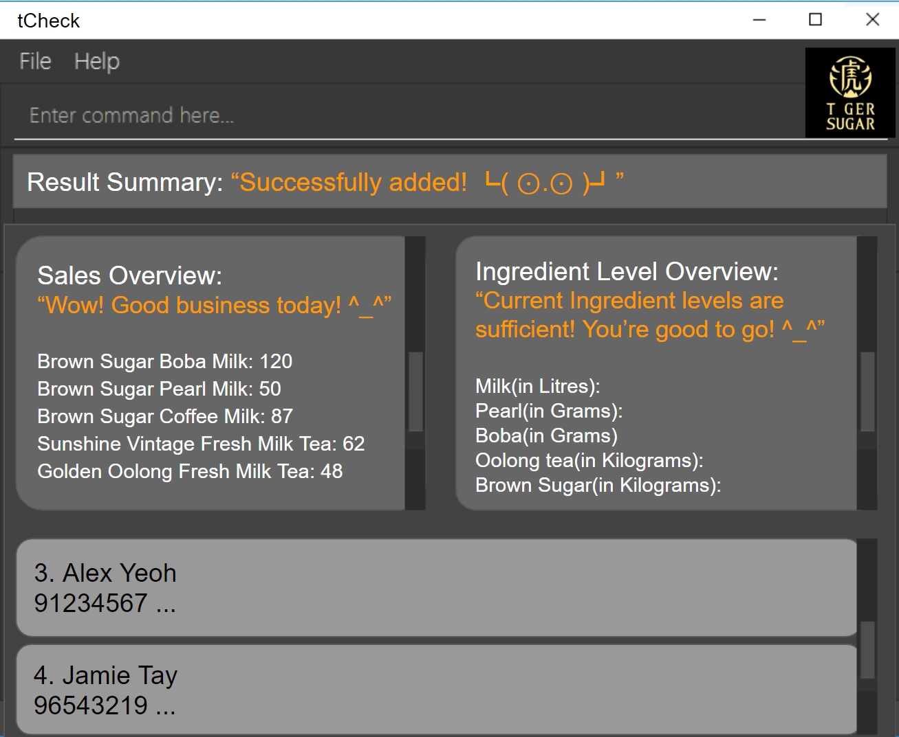

**tCheck is a desktop application that helps bubble tea store managers manage the staffs’ contact information, 
store’s inventory and historical sales data. It is optimized for CLI(Command Line Interface) users to update and 
retrieve the information more efficiently.**

* If you are interested in using tCheck, head over to the [_Quick Start_ section of the **User Guide**](UserGuide.html#quick-start).
* If you are interested about developing tCheck, the [**Developer Guide**](DeveloperGuide.html) is a good place to start.

**Acknowledgements**

* Libraries used: [JavaFX](https://openjfx.io/), [Jackson](https://github.com/FasterXML/jackson), [JUnit5](https://github.com/junit-team/junit5)
